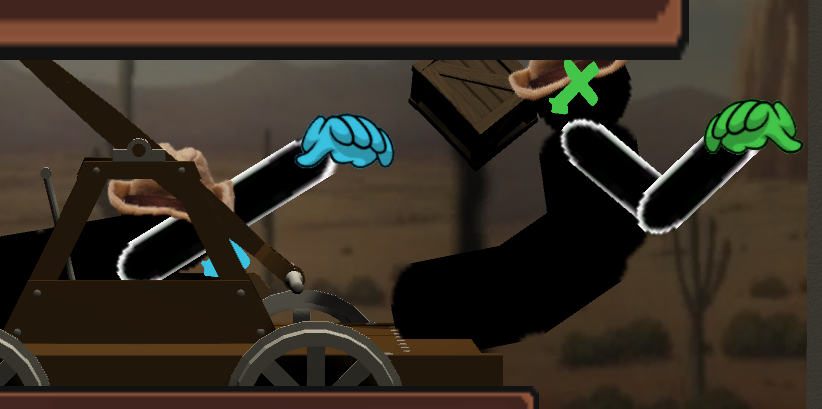

# Fight at the Museum
The budget is tight, and one of two employees is going to be laid off at the end of the day. The two employees both reason the best way to keep their job is to eliminate the other. But they must also ensure they are capable of the job still and put on a good performance!

Fight at the Museum is a quick & quirky party game where you have to multitask between throwing stage props at each other, as well as pumping the pump-cart to keep the occasional audience entertained. Balance fake pleasantries & rivalry driven toy throwing tantrums in this unconventional co-op feud! If you loose all your star ratings, you lose, if your HP gets eliminated by your opponent, you lose!

## Discussion

The game was made in a one-week game jam on my UWE Commercial Games Development course with 5 other team members! We were given the Pump-Cart, and other 3D Assets, and told to reinvent the wheel. 