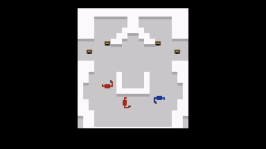

# Superflat
Time moves when you do, elimi▒ate the e░emies, mind is softwa▒e, bo█▒s are dis░osab█e, time mo▒es when you do, elimi▒ate the e░emies, mind is softwa▒e, bo█▒s are dis░osab█e, time mo▒es when you do, elimi▒ate the e░emies, mind is softwa▒e, bo█▒s are dis░osab█e, time mo▒es when you do, elimi▒ate the e░emies, mind is softwa▒e, bo█▒s are dis░osab█e, time mo▒es when you do, elimi▒ate the e░emies, mind is softwa▒e, bo█▒s are dis░osab█e, time mo▒es when you do, elimi▒ate the e░emies, mind is softwa▒e, bo█▒s are dis░osab█e, time mo▒es when you do, elimi▒ate the e░emies, mind is softwa▒e, bo█▒s are dis░osab█e, time mo▒es when you do, elimi▒ate the e░emies, mind is softwa▒e, bo█▒s are dis░osab█e, time mo▒es when you do, elimi▒ate the e░emies, mind is softwa▒e, bo█▒s are ▒i█░o▒ab█;;░█,,,,

## Discussion
SUPERFLAT is a de-make of SUPERHOT, made for a one-week Game Jam in the Commercial Games Development module. Created by myself and 5 other Uni Games Technology students, we strove to transform SUPERHOT into an Atari 2600 classic.